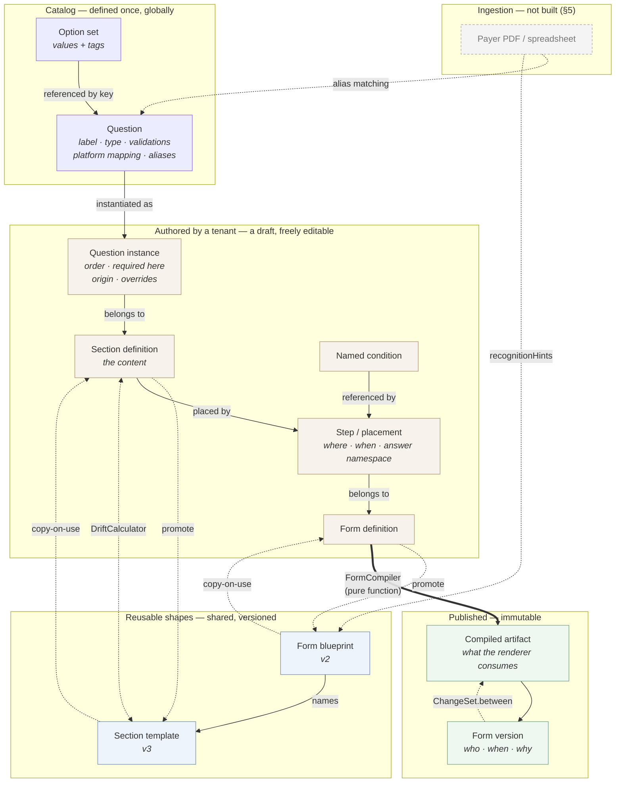

# Config-driven form authoring — POC findings and recommendation

**For:** whoever decides whether this gets built for real.
**Reading time:** about fifteen minutes. This is a decision document, not a design document — the
design is in [`form-config-poc.md`](./form-config-poc.md) and is not restated here.

---

## 1. The problem today

### Where the logic lives

`DynamicFormRenderer.tsx` is **3,991 lines in one file**, and it is where form behaviour is decided.
Changing a rule — *"hide the DEA section when specialty is one of these five"* — needs an engineer, a
ticket and a release. CP-38192 is blocked on exactly that, with two client forms waiting.

### How a form is stored and authored

`FormVersion.schema` is an opaque `JsonNode`. The backend never parses pages, sections, response
types, validations, conditional visibility or hard stops. Authoring is a JSON blob uploaded through an
admin endpoint, and nothing validates the blob — so a malformed form is discovered by a provider
filling it in, not by the system accepting it.

### What changing it costs

Three problems that compound:

- A rule change is a release.
- Destructive publishing is gated on `isTextOnlyUpdate` — a checkbox someone ticks by hand, which
  decides whether every in-progress application's answers are wiped.
- There is no way to see what a form *does* before shipping it. No logic preview, no view of which
  questions gate which.

### What accumulates

Conditions are flat and non-recursive — one `{field, operator, value}`, three operators — so "A and B"
is unsayable. That is the root cause of CP-38192, not a symptom of it.

One specialty exemption gates DEA registration, controlled substances and prescribing privileges as
three inline copies that drift independently. Nothing records where a question came from, so nothing
can reconcile an upstream change. And value lists are pasted per form: measured across two real payer
configs, `yes/no` appears **14 times** and a 54-entry state list twice.

One mechanism deserves stating on its own. `evaluateCondition` ends with `default: return true`, so a
condition the renderer does not recognise makes the step **visible**. Form gates fail open.

### Why none of it can be reused

This is the constraint with the longest shadow, and it is the least visible.

Because the logic is embedded in one React component, and because the backend treats the schema as a
blob it never compiles or validates, **there is no server-side authority on what a form means**.
Nothing outside that component can answer: is this form valid? Which steps apply given these answers?
Is this submission complete?

The consequences are structural rather than inconvenient:

- **A second consumer must reimplement everything.** A mobile app, a partner integration, a
  back-office tool, a bulk-import pipeline, an assisted-completion agent — each would need its own
  renderer *and* its own copy of the logic, which then drifts from the first.
- **Validation is unenforceable.** The frontend is the only enforcement point, so any client that
  skips it can submit whatever it likes.
- **Form structure is not queryable.** "Which forms ask for an NPI?" and "which forms would this
  catalog change affect?" have no answer short of reading every blob by hand.

Moving definition into configuration and compiling it server-side is what turns form logic from a
property of one application into a capability the platform has.

---

## 2. Recommendation

**Proceed to one bounded next phase, and decide productionisation on its result.** Build the
transformer and the answer-key override together (§12 of the design doc), run real payer configs
through `transform → compile → compare`, and treat that outcome as the gate.

The reasoning: the three things this POC set out to prove are proven, and the model held up against
two real payer forms better than expected. What is *not* yet established is that existing forms can be
brought in without losing anything — and that is the question on which a rewrite lives or dies. It is
also cheap to answer relative to committing to one.

---

## 3. The model in one page

| Concept | What it is | What it prevents |
| --- | --- | --- |
| **Question** | A question defined once, globally: label, response type, validations, platform mapping, aliases | The same question existing five times under five names |
| **Option set** | A value list referenced by key, with tags on each option | `yes/no` pasted 14 times; a 54-state list duplicated per form |
| **Section template** | A reusable section shape, versioned | Every tenant rebuilding "Licensure" from scratch |
| **Section definition** | A tenant's own section — the content. Copy-on-use from a template | A template edit silently changing a form someone is mid-way through |
| **Question instance** | One appearance of a catalog question in a section: order, required *here*, overrides, and `origin` | Losing the provenance a template upgrade needs to reconcile |
| **Form blueprint** | A reusable form shape: which templates, in what order | "Practitioner recred" being reinvented per payer |
| **Form definition** | A tenant's form — a flat, ordered list of steps | — |
| **Step** *(placement)* | One use of a section in one form: **where** it sits, **when** it appears, and **which answer namespace** it owns | Two placements of one section overwriting each other's answers |
| **Expression** | The condition grammar: recursive `all`/`any`/`not`, 12 operators, quantifiers over repeats | A flat triple that cannot say "A and B" — the actual cause of CP-38192 |
| **Named condition** | A rule defined once, referenced by several steps, **inlined at compile** | One exemption copied into three steps and drifting |
| **Compiler** | A pure function: definition + sections + catalog → artifact | Interpreting config at 2am in a submission pipeline |
| **Form version** | The compiled artifact, immutable, with who published it and why | A published form changing under a provider who signed it |
| **ChangeSet** | A diff of two artifacts → `text` / `additive` / `structural`, plus the exact answers at risk | A person ticking `isTextOnlyUpdate` by hand and wiping in-progress work |
| **Drift** | How far a section has moved from its template, split into what a re-sync would *bring in* versus *overwrite* | A "Sync" button silently deleting a tenant's customisations |
| **Compilation notice** | Something authored that this compiler version will not emit | A hard stop that never fires, looking identical to one that works |

---

## 4. How they connect, and how they are built

Three bands: what is shared, what a tenant owns, what runs. **Compilation is the only crossing**, and
the two derived reports hang off the side because that is exactly what they are — computed on demand,
never stored.

The **dotted copy-on-use arrows** are the point: nothing shared reaches into a tenant's draft after
instantiation. That is what makes a template safe to edit.

The **promote arrows run the other way, and they are what make the model a loop rather than an
import**. A tenant builds a section by hand, discovers it generalises, and promotes it — into a new
version of the template it came from, or into a brand-new template if it came from none. The same
holds one level up: an assembled form promotes into a blueprint the next form starts from.

Two details in that upward path are load-bearing:

- **A form can only be promoted once every section it places is template-backed.** A blueprint points
  at templates, so there is nothing else for it to reference. That reads as a restriction and is
  really an ordering — promote the sections, then the form — and the refusal names the steps rather
  than silently dropping them.
- **A blueprint carries conditions, not only structure.** Placements hold their `visibleWhen` and the
  blueprint holds the named conditions those rules reference. A shape that kept only the structure
  would instantiate into a form whose steps all show unconditionally, which is precisely the defect
  three Florida Blue sections ship with today — and it would look like a success, because the form
  renders.

### The same objects, over time

```mermaid
flowchart LR
  CAT["<b>Catalog</b><br/>questions · option sets<br/><i>proposed → active</i>"]
  START["<b>Start</b><br/>pick a blueprint<br/><i>or start blank</i>"]
  DRAFT["<b>Draft</b><br/>sections + form<br/><i>copy-on-use</i>"]
  EDIT["<b>Customise</b><br/>disable · add · reorder<br/>set conditions"]
  CHECK["<b>Check</b><br/>validate · draft preview<br/>change preview"]
  PUB["<b>Publish</b><br/>immutable version<br/><i>named conditions inlined</i>"]
  SERVE["<b>Serve</b><br/>provider fills the<br/>compiled artifact"]

  CAT --> START --> DRAFT --> EDIT --> CHECK --> PUB --> SERVE
  CHECK -. "problems pinned<br/>to the tree" .-> EDIT
  SERVE -. "the next change<br/>starts a new version" .-> EDIT

  classDef draft fill:#f7f3ec,stroke:#b09a75
  classDef frozen fill:#eef7f0,stroke:#78a888
  classDef shared fill:#eef4fb,stroke:#7591b0
  class CAT,START shared
  class DRAFT,EDIT,CHECK draft
  class PUB,SERVE frozen
```

Three things this sequence makes concrete.

**Everything before Publish is reversible, and everything after it is not.** A draft is freely
editable; a version is an audit record a provider answered against. Compilation is where that line
falls, which is also where named conditions are frozen — editing a shared rule afterwards cannot reach
a version already published.

**Check is a loop, not a gate.** Validation compiles without persisting and returns *every* problem
pinned to its step, so an author fixes them in one pass rather than one per publish attempt.

**There are two previews, at different stages.** The draft preview evaluates the draft's own
conditions in the browser and needs no version — it is how an author checks a rule while writing it.
The provider-facing fill preview renders the **compiled artifact**, so it requires a publish. That is
deliberate rather than incidental: rendering the draft would only prove the studio can draw its own
data structure, whereas rendering the artifact proves the artifact is consumable. It does mean an
author cannot see the provider's exact view until a version exists — a real limitation, and the
cheapest fix would be compiling to a throwaway artifact for preview only.

---

## 5. Where this leads: the ingestion layer

**Not built.** Payer forms arrive as PDFs and spreadsheets, and the path today is a person reading one
and producing a JSON blob. An ingestion layer would parse the document, match fields against the
catalog by label and alias, land unmatched ones as `proposed` for a steward to promote, and guess the
closest blueprint — with a human reviewing before anything becomes a definition.

What matters here is that **four hooks already exist and were put there for it**: `Question.aliases`,
`CatalogStatus.PROPOSED`, `DuplicateDetector`, and `FormBlueprint.recognitionHints`. Ingestion is an
additive layer, not a re-model. The counterweight: cross-form question reuse measured at 2 of ~99
field names, which caps how much automatic matching can achieve.

---

## 6. What was proven

| Claim | Evidence |
| --- | --- |
| The model expresses a real payer form | Florida Blue Recred compiles: **9 steps in, 9 out**. One section placed twice yields `practiceLocation.line1` and `billingAddress.line1` as disjoint namespaces |
| CP-38192's rules are pure config | Verified by **evaluating the compiled artifact**, not by reading the source: specialty `DC` hides DEA, `Cardiology` shows it, Billing Address requires both AND clauses |
| One grammar, two implementations, in agreement | **84 conformance fixtures** run by both the Java and TypeScript evaluators from the same files |
| Destructive publishing becomes computable | A structural edit reports `structural`, `resets answers`, and **one** named key — not a blanket warning |
| The authoring loop works without an engineer | Instantiate a template → disable → add → see drift → promote, all through the UI against real MongoDB |
| **A new payer form can be built from nothing** | Catalog → blank section → add questions → place as steps → name a rule → publish, with no fixture, blueprint or template involved. Asserted on the **compiled artifact**, not the draft |
| **A shape becomes reusable, and the rules survive** | The assembled form promotes to a blueprint, and a second form instantiated from it arrives with its placements, step keys **and conditions** intact |
| **The rule set is inspectable, including its gaps** | One read returns every step, named and question condition with what each depends on — resolved *through* refs, so a step gated only by a name still reports the question underneath. Unconditioned steps are listed rather than filtered, which is the only way the Florida Blue defect is visible at all |
| Normalisation pays off, measured | **18 inline option lists collapse to 3**; `yes/no` alone was pasted 14 times |

Test counts: **582** backend, **147** studio, **85** in the grammar package (84 conformance fixtures
plus one guard that the fixture set actually loaded — an empty set would otherwise pass vacuously),
and **62** browser specs against a live stack. A clean clone of the repository builds and passes.

The browser suite matters disproportionately, because it is the only thing that can check the two
claims that matter most: that the artifact the compiler produces is renderable, and that an edit made
in the UI reaches the database. Every bug it caught was of that kind.

### Two screens that are not features so much as instruments

Worth calling out separately, because they exist to make the rest measurable rather than to do
anything themselves.

**A rules inventory.** One request returns every step condition, named condition and question
condition a tenant has, each with the answer paths it depends on — resolved *through* named
conditions, so a step gated entirely by a reference still reports the question underneath it. That is
the reverse index behind "what breaks if I change this question", which was previously unanswerable
without opening every form. It also lists the steps that have **no** rule, which is the only way the
production defect this whole design is about — three Florida Blue sections shipping unconditioned — is
visible at a glance rather than by counting.

It is derived on every call and stored nowhere. An index of rules that could disagree with the rules
is worse than no index, because an author would trust it.

**Author-facing documentation, generated where it can be.** §6 of the design doc describes the grammar
for an engineer implementing against it; what did not exist was a page describing the decisions an
*author* makes. Two parts of it are generated rather than written: the operator table comes from the
same registry that drives the condition builder's dropdown, and every worked example's
shows/hidden verdict is computed live by the same evaluator the conformance suite runs. Documentation
that restates behaviour in prose is documentation that will eventually lie; this is the cheapest
available defence.

### A defect this surfaced, and what it says about the method

Asked whether the model supports question-to-question and question-to-section relationships, checking
rather than answering from the design turned up a real defect — and its shape is more instructive than
its severity.

**Question rules were not placement-scoped.** Answers were, from the first week, and there is a test
asserting it. Rules were not. A rule inside a section had to name the placement key
(`practiceLocation.line1`), which hardcodes a placement into reusable content — so the same section
placed twice gated **both** copies on the first copy's answer. It compiled clean. The billing
address's field appeared because of something typed in the practice location.

The cause was not carelessness in either half. The section aggregate and its unit tests were written
for bare sibling keys and pass. The compiler's scope was keyed only by qualified paths, so a bare key
failed as `DANGLING_PATH`. The fixtures were then written qualified, to satisfy the compiler. **Two
halves of one feature, each internally consistent, disagreeing with each other — and no test spanning
both.** The specification was silent on the one question that would have settled it: how a rule inside
a reusable section names a sibling.

The compiler now qualifies bare keys per placement, refuses a rule that reaches into another placement
of its own section, and raises a notice for one that names its own placement key — correct today, and
no longer reusable. §6 of the design doc now states the addressing rule, since its silence was the
root cause.

Two things worth taking from it. First, **a passing test suite on each side of a seam proves nothing
about the seam**; the missing test was the one that compiled a form containing a section that used the
domain's own convention. Second, the defect was invisible in the fixtures by luck alone — the
twice-placed section happened to carry no question rules.

### The gap this table used to hide

The two bold rows above were added late, and the reason is worth recording, because it is a general
warning about how a POC can flatter itself.

For most of the build, the API's entire write vocabulary was five commands: create-a-form-from-a-
blueprint, create-a-section-from-a-template, update-a-step's-condition, preview, publish. Everything
in the demo worked. The rule change that CP-38192 is about worked. What did not exist was any way to
**place a section into a form** — so every form had to be instantiated from a blueprint, and every
blueprint was a JSON fixture written by hand. A payer nobody had onboarded before had no way in at
all.

Nothing failed, because the seed data covered for the missing verb: a form was always already there
to edit. The aggregates were never the problem — `placeStep`, `removeStep` and `withNamedCondition`
had been on `FormDefinition` from the first week, reachable only from the blueprint path and from
unit tests. The absence was in the layers above them, and the demo script never walked through it.

The lesson is not "we forgot an endpoint". It is that **a fixture that stands in for a workflow will
hide the absence of that workflow indefinitely**, and the more convincing the fixture, the longer it
hides it. The check that would have caught this on day one is the one that now exists: a test that
starts from an empty tenant and a catalog, and refuses to use a fixture for anything else.

---

## 7. What cuts against the design, risks, and next steps

### Three findings that argue against parts of this

**Cross-form question reuse is far weaker than assumed.** Only **2 of ~99** field names appear in both
audited payer forms — `attestationDate` and `npi`. Two facility applications from different payers
share almost nothing at the question level. That reframes the catalog's value as *aliasing and
duplicate prevention* rather than composition. The one shared question proves the narrower point:
`npi` is labelled "NPI" in one form and "NPI Number" in the other.

**The condition slot is not backward compatible, and I said otherwise.** The original success criterion
was "zero rendering-engine changes". That is unachievable — a recursive `all`/`any`/`not` cannot be
expressed in production's flat triple, which is the very thing CP-38192 needs. The honest framing:
this design removes the need to change the renderer for *structure*, and makes explicit a change that
*conditions* already required.

**Three constructs the model cannot express**, from 99 fields and 16 conditions audited: production's
flat global answer keys (the only one that changes the model — §1.1 of the audit), field-level hard
stops with an implicit subject, and repeating sub-forms inside a non-repeating step. Details in
[`form-config-poc-expressiveness-audit.md`](./form-config-poc-expressiveness-audit.md).

### Risks, and which were actually tested

| Risk | Mitigation | Tested? |
| --- | --- | --- |
| Catalog rot — near-duplicates accumulate until reuse collapses | `proposed → active` staging, `DuplicateDetector` on promote, aliases | Yes — promotion is blocked on a near-duplicate label and on an alias match |
| The two evaluators drift apart | Shared conformance fixtures, run by both | Yes — 84 cases, both sides, same files |
| Publishing wipes provider answers | Change class computed from an artifact diff, at-risk answers named | Yes — end to end, including the destructive case |
| Fixtures flatter the model | Audit against two real payer configs | Partly — by inspection, not mechanically |
| **Fixtures stand in for a workflow, hiding its absence** | A test that starts from an empty tenant and a catalog, and uses no fixture for anything else | Yes — now. This risk is the one that actually materialised: it hid the absence of form assembly for most of the build |
| Existing forms cannot be brought in | The transformer | **No — this is the open question** |

### Next steps

1. **Build the transformer with the answer-key override** (§12). They land together or not at all. The
   measuring instrument is ready: `ArtifactComparison`, 16 calibration tests, verified to fail on both
   too-strict and too-lax comparisons.
2. **Decide on real configs.** Needs someone to pull production schemas from an environment. Without
   them the gate is inspection, as it is today.
3. **Then decide productionisation**, with the round-trip result in hand rather than as a projection.

Two items need an owner rather than a decision: the renderer's `default: return true`, which makes
form gates fail open, and the three features this compiler stores but does not emit.
